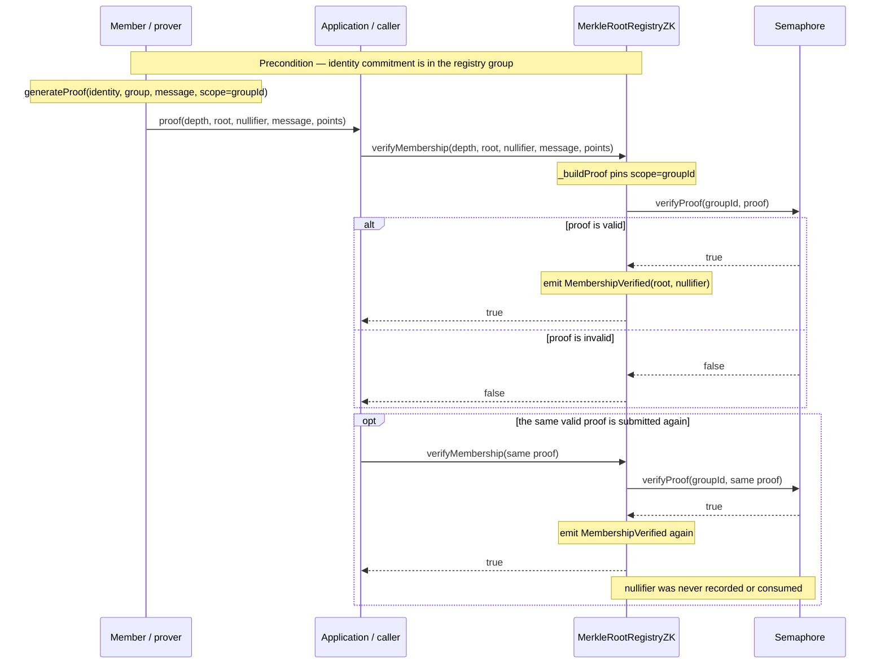
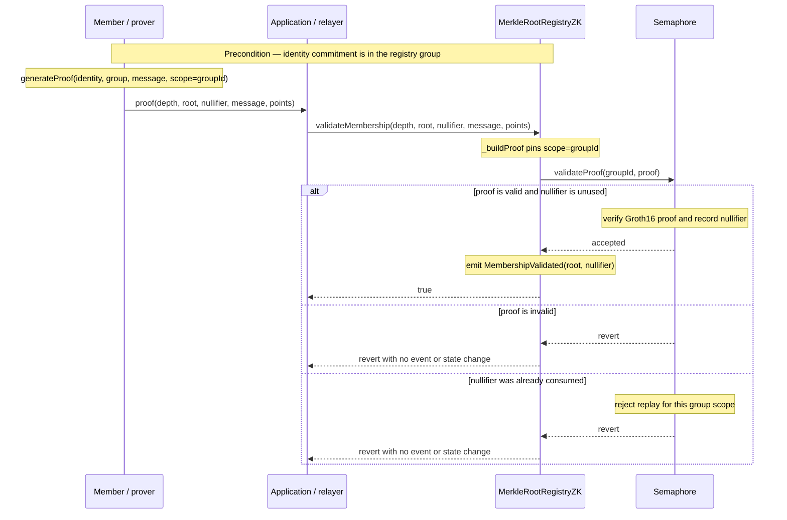

<!--
SPDX-FileCopyrightText: 2026 PlanB foundation

SPDX-License-Identifier: AGPL-3.0-or-later
-->

# Swissledger AnonSet

Anonymous Semaphore v4 membership on SwissLedger. This repository provides a
single Semaphore group, a Node.js proof client, a pinned Istanbul-compatible
toolchain, local protocol smoke coverage, and a protected fresh-testnet CI
workflow. It does **not** designate a canonical production deployment.

## Start here

Prerequisites are Node.js 24, npm, `curl`, and `sha256sum` (or `shasum`). The
installer downloads only checksummed SwissLedger Foundry v1.11.0 binaries into
this checkout's ignored `bin/` directory; it does not install stock Foundry or
modify a shell profile.

```bash
make toolchain-install
npm ci
make toolchain-info
make test
```

`make test` is the complete local quality gate: generated-file drift,
formatting, production dependency policy, deterministic Istanbul artifacts,
unit/fuzz/client tests, static analysis, coverage, and an isolated local Anvil
protocol smoke. Run `make help` for focused targets. The build is pinned to
Solc 0.8.30 and `evm_version = "istanbul"`; do not substitute stock Foundry
or London-era settings.

Agents and automated maintainers should also read [USAGE.md](USAGE.md) and
[AGENTS.md](AGENTS.md) before changing the repository.

## Verified readiness snapshot

As of 8 August 2026, source commit `f0258ce` passed the complete local gate and
protected PR workflow
[31228455338](https://github.com/LuganoPlanB/swissledger-anonset/actions/runs/31228455338).
GitHub tested merge commit `e6b25df317d1f3f54ad05bcdd09135790c64d2e1`:
the local quality gate, a fresh chain-222 deployment and real ZK smoke, artifact
upload, and independent downloaded-evidence validation all succeeded. The
evidence retained the upstream RPC hostname and four-contract linked stack.

This establishes local and testnet release readiness. It is not approval for a
canonical chain-110 deployment: the external Solidity/ZK audit, production
multisig/key governance, and manual promotion approval remain required.

### Test and coverage measurements

The verified gate includes 23 repository Node tests, 6 hardened CLI tests,
4 real Groth16 proof-integration tests, 42 Solidity tests, two 256-run Solidity
fuzz tests, ShellCheck, dependency and artifact-integrity gates, and repeated
and parallel local smoke tests with injected-failure cleanup. Production
`npm audit` reported zero findings.

| Solidity coverage scope | Lines | Statements | Branches | Functions |
|---|---:|---:|---:|---:|
| `MerkleRootRegistryZK.sol` | 96.04% | 95.51% | 86.67% | 95.45% |
| Vendored `PoseidonT3.sol` | 100.00% | 100.00% | n/a | 100.00% |
| Complete Forge coverage report | 96.52% | 95.62% | 81.25% | 93.10% |

The deployment script is verified through real local and protected testnet
flows rather than Solidity source coverage. Coverage is a regression guard,
not a claim that every possible state or provider failure has been enumerated.

### Protected testnet benchmark

These measurements come from the same protected workflow and chain-222 RPC
path. Gas is deterministic for the recorded transaction inputs; durations are
runner, network, and provider observations useful for regression comparison,
not latency service-level guarantees.

| Operation | Gas used | Observed duration |
|---|---:|---:|
| Deploy PoseidonT3 | 3,694,045 | 6.711 s |
| Deploy SemaphoreVerifier | 3,720,276 | 4.243 s |
| Deploy Semaphore | 1,827,122 | 4.991 s |
| Deploy MerkleRootRegistryZK | 1,447,681 | 3.773 s |
| Add first member | 117,292 | 4.409 s |
| Add second member | 154,650 | 4.844 s |
| Reusable verification #1 | 259,106 | 6.776 s |
| Reusable verification #2 | 259,106 | 5.726 s |
| Replay-protected validation | 286,515 | 3.134 s |
| Remove member | 114,142 | 4.255 s |

Aggregate deployment gas was **10,689,124**, protocol-transaction gas was
**1,190,811**, and combined gas was **11,879,935**. Identity setup took
**0.446 s**, proof generation **1.084 s**, and the complete semantic smoke
**36.279 s**. The downloadable manifest is the authoritative record and also
contains receipt/block identities, per-operation measurements, runtime-code
hashes, ABI/bytecode hashes, dependency evidence, and semantic outcomes.

The chain-reconstructing CLI was also measured locally against the pinned
Anvil stack with two insertion slots. Deployment discovery took **36.484 ms**,
event fetch **21.335 ms**, tree reconstruction **20.530 ms**, Groth16 proof
generation **579.703 ms**, gas estimation **136.395 ms**, and the complete
command **890.153 ms**. The subsequently executed reusable and protected
transactions consumed **263,982 gas** and **291,391 gas**. In that run the RPC
estimated 85,963 and 293,845 gas respectively, illustrating that
`eth_estimateGas` is advisory: signed receipt `gasUsed` is the authoritative
measurement and applications must retain an appropriate transaction gas
margin.

## Application integration and proof semantics

There are two deliberate on-chain proof flows. The first is replay-permitting,
not “under replay attack”: it is a reusable membership query by design. The
second consumes the proof nullifier and is appropriate for a one-time claim.
In both cases the member generates a Semaphore proof off-chain with
`scope = groupId`; the registry reconstructs the proof with its immutable
`groupId`, preventing callers from selecting another scope on-chain.

### What the proof reveals

The Merkle root alone is sufficient to identify a tree state, but it is not
sufficient to generate a membership proof. The prover also needs the identity
secret and the Merkle inclusion witness connecting its public commitment to
that root. Semaphore keeps those values inside the Groth16 witness.

| Value | Purpose | Visibility during verification |
|---|---|---|
| Identity secret | Proves control of the member identity | Private; never sent on-chain |
| Identity commitment | Leaf stored in the Semaphore group | Public in group events/state |
| Merkle sibling path and indices | Connect the leaf to the selected root | Private proof witness; not passed to the verifier |
| Merkle tree depth | Number of tree levels/path length | Public proof input; not the path itself |
| Root, nullifier, message, scope | Bind the proof to tree state and application semantics | Public proof inputs |
| Groth16 points | Succinct proof of the hidden witness | Public, constant-size proof |

Although the path is not revealed by a ZK proof, it is not inherently secret:
anyone who reconstructs the same public commitment tree can derive it. The ZK
property prevents the verifier from learning which commitment/path the prover
used.

### Reusable verification — replay permitted

Call either overload:

```solidity
verifyMembership(depth, root, nullifier, message, points)
verifyMembership(depth, root, nullifier, points) // message = 0
```

The registry calls `Semaphore.verifyProof(groupId, proof)`. A valid proof
returns `true` and a transaction emits `MembershipVerified`; an invalid proof
returns `false`. No nullifier state is written, so submitting the same valid
proof again can succeed and emit the event again. Use this for repeatable
membership/authentication checks where replay has no one-time economic or
authorization effect.



### Protected validation — replay rejected

Call either overload as a transaction:

```solidity
validateMembership(depth, root, nullifier, message, points)
validateMembership(depth, root, nullifier, points) // message = 0
```

The registry calls `Semaphore.validateProof(groupId, proof)`. On the first
valid use, Semaphore records the nullifier, the registry emits
`MembershipValidated`, and the call returns `true`. An invalid proof or a
second use of the same nullifier reverts; reverted calls emit no event and
retain no partial state. Use a claim-specific `message` when the proof must be
bound to an application action rather than generic membership.



The CLI command `verify on-chain` performs a read-only `staticCall` to the
five-argument `verifyMembership` overload. It returns the reusable result but
does not create a transaction or emit `MembershipVerified`. Applications that
need replay protection must submit `validateMembership` as an actual
transaction, normally through their relayer or transaction signer.

The events are intentionally distinct: `MembershipVerified` means a reusable
check; `MembershipValidated` means successful one-use validation.

### Checking current membership without a path

If an application already has a public Semaphore identity commitment, it does
not need a Merkle path merely to check current membership. Read the registry's
immutable `semaphore` and `groupId`, then call Semaphore directly:

```bash
bin/swissledger-cast call <registry-address> \
  'semaphore()(address)' --rpc-url <rpc-url>

bin/swissledger-cast call <registry-address> \
  'groupId()(uint256)' --rpc-url <rpc-url>

bin/swissledger-cast call <semaphore-address> \
  'hasMember(uint256,uint256)(bool)' \
  <group-id> <identity-commitment> --rpc-url <rpc-url>
```

`hasMember` uses Semaphore's on-chain commitment-to-index mapping and reflects
current membership, including removal. `indexOf(groupId, commitment)` returns
the current leaf index and reverts if the commitment is absent.

An application username, database key, wallet address, or other external
“member identifier” is not a Semaphore commitment. The chain cannot check it
unless the application maintains an explicit mapping. Likewise, knowing a
commitment is enough to query public presence but not to create an anonymous
proof: proof generation requires the corresponding identity secret.

### Obtaining a path as a new participant

The contract does not provide a getter that returns sibling paths. A new prover
derives one by reconstructing the public LeanIMT from chain events, or by using
an indexer snapshot whose root is independently checked on-chain:

1. Read `semaphore()` and `groupId()` from the registry and identify the group
   creation block.
2. Scan the Semaphore contract for `MemberAdded`, `MembersAdded`, and
   `MemberRemoved` events for that group. Process logs in canonical
   `(blockNumber, transactionIndex, logIndex)` order.
3. Insert additions at their emitted `index`/`startIndex`. On removal, replace
   the emitted leaf index with zero; LeanIMT insertion positions are not
   renumbered or shrunk.
4. Compare the reconstructed `Group.root`, depth, and size with Semaphore's
   `getMerkleTreeRoot`, `getMerkleTreeDepth`, and `getMerkleTreeSize` calls.
5. Find the participant commitment with `group.indexOf(commitment)`. The
   Semaphore Group library can then derive the path with
   `group.generateMerkleProof(index)`, while `generateProof` performs this step
   internally when given the identity and reconstructed group.

An indexer may cache and publish `Group.export()` snapshots to avoid replaying
the complete history for every client. Each snapshot should include its chain,
Semaphore address, group ID, block number/hash, root, depth, and size. A client
must import it and compare the resulting root to the contract; therefore the
indexer supplies availability and speed, not authority over membership.
Production indexers must also chunk `eth_getLogs` requests, preserve event
ordering, wait for the application's required finality, and roll back snapshots
after a chain reorganization.

Use the current tree where possible. Semaphore accepts the current root and,
for groups created by this registry, historical roots for one hour. A proof
generated from an older snapshot will revert after that root expires.

The bundled CLI currently accepts a `group.json` containing 1–1,024 commitments
and also provides a chain-reconstruction command for 1–1,024 insertion slots.
With only the identity secret and public chain coordinates, use:

```bash
# Preferred: owner-only identity file.
npm run anonset -- proof generate-chain identity.json \
  <registry-address> <rpc-url> <chain-id> 0 > proof.json

# Raw 32-byte hexadecimal secret from a secret manager, never a command argument.
secret-manager read anonset-identity |
  npm run anonset -- proof generate-chain - \
    <registry-address> <rpc-url> <chain-id> 0 > proof.json
```

The command automatically binary-searches historical bytecode for the registry
deployment block, reads `semaphore()` and `groupId()`, downloads member events
in bounded block ranges, and replays them in canonical order. It verifies each
event's emitted root and finally compares root, depth, and size against the
same on-chain snapshot. It then checks that the secret-derived commitment is an
active member and generates a proof scoped to the registry group ID. A pruned
RPC may require a trusted deployment block as the optional final argument; the
RPC must still retain the event logs.

`proof.json` includes non-secret `chain`, `metrics`, and `gasEstimates` objects.
The timings split deployment discovery, log fetch, reconstruction, Groth16
proof generation, gas estimation, and total wall time. Gas values are decimal
`eth_estimateGas` results for the five-argument reusable and protected calls,
or `null` when estimation is unavailable. The output deliberately omits the
identity commitment and leaf index, because attaching either to the proof
would reveal which public member produced it. Larger or frequently changing
groups should use an indexed/exported tree representation rather than replaying
the full history for every proof.

### Member-count cost scaling

Let `N` be LeanIMT's insertion count, including positions later zeroed by
removal. Tree depth and path length grow approximately as `ceil(log2(N))` and
increase at powers of two.

| Operation | Effect of more insertion positions |
|---|---|
| `hasMember(groupId, commitment)` | Approximately constant lookup through the commitment mapping |
| Add one member | O(log N) tree work and storage updates |
| Remove or update a member | O(log N) hashing plus O(log N) sibling calldata |
| Derive a path from an already reconstructed tree | O(log N) sibling values |
| Reconstruct the tree from its full event history | O(N) leaves/mutations overall |
| Generate a Groth16 proof | Increases with supported tree depth, not linearly with every member |
| Verify or validate a Groth16 proof | Constant-size proof; cost does not grow linearly with member count |

| Insertion positions | Approximate depth/path values |
|---:|---:|
| 2 | 1 |
| 1,024 | 10 |
| 1,048,576 | 20 |
| 4,294,967,296 | 32, the supported proof-depth maximum |

`hasMember` is normally an `eth_call`, so the caller pays no transaction gas.
Tree reconstruction, path derivation, and proof generation are also off-chain
costs: they consume client/indexer CPU, memory, RPC bandwidth, and time rather
than blockchain gas. Adds, removals, `verifyMembership` transactions, and
`validateMembership` transactions consume gas.

The benchmark above used a two-member, depth-1 tree: reusable verification
consumed 259,106 gas and protected validation 286,515 gas for the recorded
inputs. Treat those as a regression baseline, not a promise for every depth or
message. Groth16 proof calldata remains constant-size as the group grows, while
the selected depth-specific verifier and surrounding contract checks may cause
modest depth-dependent differences. Removal calldata grows by one sibling field
element per additional tree level.

Batch insertion is more efficient than separate transactions and this registry
caps a batch at 64 commitments. Application capacity planning should benchmark
representative depths and provider conditions instead of extrapolating linearly
from the two-member smoke run.

### Removal path visibility

`removeMember(identityCommitment, merkleProofSiblings)` is an administrative
tree mutation, not an anonymous proof. Both the removed commitment and sibling
array are visible in transaction calldata and remain in blockchain history for
participants able to inspect it. The registry does not store the siblings in
contract storage or emit them separately, but calldata is public data.

This does not disclose the identity secret and does not by itself link earlier
anonymous proofs to the removed commitment. If an application required the
removal path or commitment itself to remain confidential, it would need a
different ZK-based removal protocol; the current Semaphore group mutation API
does not provide that property.

The registry has a two-step owner transfer (`transferOwnership`, then
`acceptOwnership`). The accepted owner becomes a member manager; explicitly
added managers are retained. See [operations](docs/OPERATIONS.md) before any
administrative action.

## Chains and deployment evidence

| Network | Chain ID | Purpose |
|---|---:|---|
| SwissLedger testnet | `222` | Protected CI deploys a new application stack plus its linked PoseidonT3 library for each trusted run. |
| SwissLedger production | `110` | Manual governance-gated promotion only; no workflow deploys it. |

The test workflow runs local gates for pull requests, `main` pushes, and manual
runs. Its secret-bearing testnet job runs only after local gates on a protected
`main` push/workflow dispatch, or on a same-repository PR whose base is `main`.
The latter requires explicit `swissledger-testnet` GitHub Environment approval;
fork PRs remain secret-free and cannot start the testnet job. It requires the
organization variable `SWISSLEDGER_TESTNET_RPC` (credential-free RPC URL),
organization variable `SWISSLEDGER_TESTNET_ADDRESS` (expected public deployer
address), and organization secret `SWISSLEDGER_TESTNET_DEPLOY` (deployer key).
The scripts derive the key address and reject a mismatch. Never put the key or
RPC credentials in files, command lines, artifacts, issue text, or logs. PR
validation creates fresh testnet evidence only; it never starts a release.

Each successful trusted run uploads `anonset-testnet-<commit>` for 90 days. It
contains a secret-scanned manifest, contract ABI/bytecode hashes, deployment
and smoke receipts, and dependency evidence. Testnet addresses prove that
specific fresh CI run only; they are not canonical production addresses.
Release runs download and validate this exact-commit evidence before publishing
GitHub-only semantic-release output. Package publication is disabled.

For the manual chain-110 checklist, address/code verification, and the
mandatory production governance gates, see [deployment](docs/DEPLOYMENT.md).
The current handoff status and explicit external blockers are in
[readiness evidence](docs/READINESS.md).

## Client

```bash
npm run anonset -- identity create identity.json
npm run anonset -- proof generate-chain identity.json <registry-address> <rpc-url> <chain-id> 0
npm run anonset -- proof generate identity.json group.json 0 <group-id>
npm run anonset -- verify local proof.json
npm run anonset -- verify on-chain <registry-address> proof.json <rpc-url> <chain-id>
```

See [clients/anonset/README.md](clients/anonset/README.md) for exact argument
rules, safe identity handling, and local/on-chain verification.

## Versioning and release

The package is private. Conventional commits drive GitHub-only semantic-release
tags and release notes. `BuildInfo.sol` embeds the package version and the
release workflow refuses a release unless rebuilt artifacts match the fresh
chain-222 evidence for the exact `main` commit. A release is not a production
deployment authorization.

## Licensing

Swissledger AnonSet is Copyright (C) 2026 PlanB Foundation and is licensed
under the GNU Affero General Public License, version 3 or later, without
warranty.
